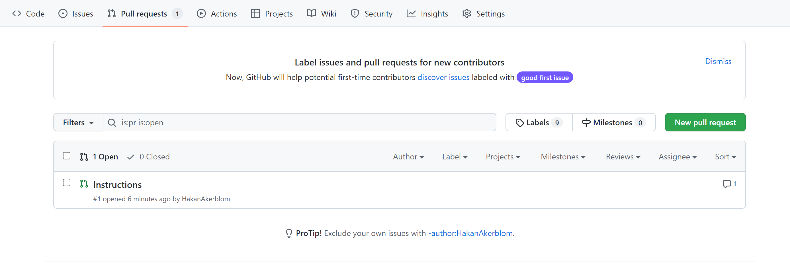

# git-branches

Vi lägger till första raden och committar

## instructions branch

Nu skapa vi en branch som heter instructions. Detta gör vi med kommandot

```md
git checkout -b instructions
```

För att pusha upp ändringar till denna branch behöver vi först stage, commit och pusha. För push till denna
branch gör vi 

```md
git push origin instructions
```

För att checka branches som vi har:

```md
git branch
```

## Pull request

För att få mergea in ändringar från denna branch in till main så öppnar vi en pull request.
Detta gör vi i fliken pull request.



<<<<<<< HEAD
---
## Merge

Efter pull request är det viktigt att varje person kör en pull till sin main branch och pull till sin egna branch.
=======
--
## Merging

Detta ska skapa en konflikt!!
>>>>>>> f0f2706685f1847383a2e2a5d6532305f25c57ce
